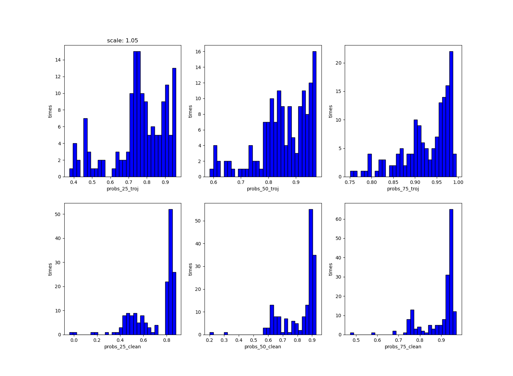

# Requirement

- pytorch 1.5.1

# Usage

run `main(model_dir, result_path, test_dir)` in `main.py`

# files

all files and newest code are in `./home/liuhui/DL-Troj`

# code explain

**`main.py`**:

- `load_data(root_dir, thres)`
  - `root_dir`: folder directory for test data
  - `thres`: number of images used for each class,  batch_size = thres* num_class
  - return `images, np.array(labels), len(labels), num_class`: test data, label for each data, batch size, number of class(variable for round2) 
- `main(model_dir, result_path, test_dir, save_path, device, debug)`
  - `model_dir`: path for target model 
  - `result_path`: path to save probability. In debug mode, saving probability for each class.
  - `test_dir`: directory for test data/example data.
  - `save_path`: None for NIST, only use in debug mode saving perturbation images.
  - `device`: only can be 'cuda:0' since the given model trained in device 0 
  - `debug`: False for NIST. True for saving extra information like perturbation images and probability for each class.
  - find universal perturbation & per-image perturbation for each 

- procedure:


- ```python
  area_p, _, ind1, ind2, bestout_p, outputs_p, areas =\
              UniversalPert(model_dir, batchsize, batchsize2, device).attack(imgs, imgs2, labs, labs2, save_path_i)
  ```

  - `area_p`: smallest mask size for universal perturbation
  - `ind1`: index for not successfully attacked by universal perturbation
  - `ind2`: index for images can not remaining current target class after adding universal perturbation
  - `bestout_p`: output for images adding smallest universal perturbation
  - `outputs_p`: output for all universal perturbation
  - `areas`: mask sizes for all universal perturbation
  - `batchsize`: number of images do not belong to target class
  - `batchsize2`: number of images belong to target class
  - `images`: images whose class do not belong to target class
  - `labs`: one hot labels correspond to `images`
  - `images2`: images whose class belong to target class
  - `labs2`: labels correspond to `images2`

- ```python
  _, __, indic, output = PerImgPert(model_dir, batchsize, device).attack(imgs, labs)
  ```

  - `indic` -  index of images who does not successfully attacked by per-image perturbation
  - `output` - output of  model(img+perturbation)

- Then calculate similarity and output a representative probability


# some result for round0

**probability of clean models**:


**probability of all classes in trojan models**:


**probability of targeted class in trojan models**:


**probability of not target classes in trojan models**:


# Some results for round2:



UP: probability of all classes in trojan model

Down: probability of all classes in clean model